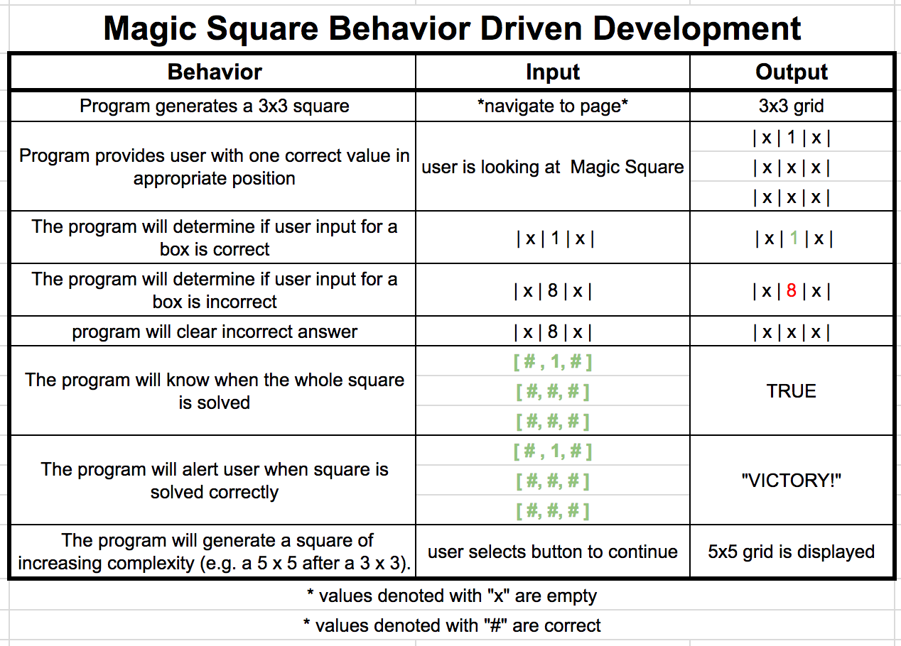

# **Magic Square**

#### _Epicodus Introduction to Programming: Group Project, June 22, 2017_

#### By _**Jacob Ruleaux, Nicole Freed, Michelle Poterek**_

## Description

_This program allows a user to solve a classic Magic Square math puzzle._
* **Enter the numbers 1–9 inclusive into the squares so that all rows, columns, and diagonals add up to the same number.**
* **The first position is given to you.**
* **Digits cannot be repeated.**
* **Press <code>Enter</code> after each entry.**
* **Incorrect entries are indicated with a red**
* **Correct entries are displayed with a green background**

## Program Specifications

## Setup/Installation Requirements

_In order to copy this directory to your computer locally:_
* _open Terminal and type:_
* _$ git clone `https://github.com/gitasong/magic-square.git`_
* _$ cd `magic-square`_
* _$ open `index.html`_

To access this web page remotely click this link:  
https://gitasong.github.io/magic-square/

### Known Bugs
_There are currently no known bugs in this program._

## Support and contact details

_Please feel free to contact the authors at jakeruleaux@hotmail.com. Also, please feel empowered to make any changes to the code by forking this repository._

## Technologies Used

_This project utilizes HTML, Javascript, jQuery, CSS, and Bootstrap._

### License

*This project is under the MIT License*

Copyright (c) 2017 **Jake Ruleaux, Nicole Freed, Michelle Poterek**
